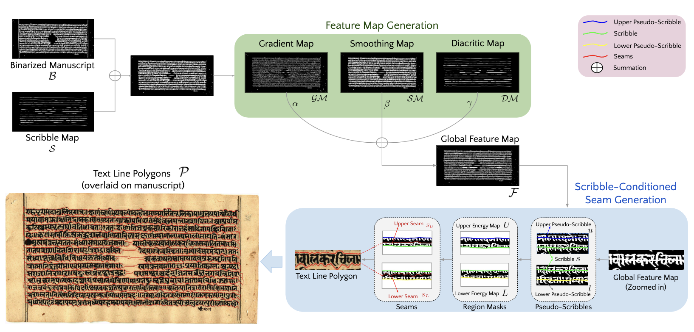

<div align="center">

<samp>

<h1> SeamFormer </h1>

<h2> High Precision Text Line Segmentation for Handwritten Documents </h2>

</samp>

**_To appear at [ICDAR 2023](https://icdar2023.org/)_**

| **[ [```Paper```](<https://drive.google.com/file/d/1UU_4irR3m8IuuzuOXYl35eK6UbD2d3tH/view>) ]** | **[ [```Website```](<https://ihdia.iiit.ac.in/seamformer/>) ]** |
|:-------------------:|:-------------------:|

<br>

</div>

<div align="center">
    <!-- <a href="https://youtu.be/V4XWngkrtxQ">
        
    </a> -->
<!-- <br> -->
<table>
    <tr>
        <td>
            <a href="https://drive.google.com/file/d/1aztOQW7b24D1OqzJ3Yv-j9XPG0iBbnap/view?usp=share_link" target="_blank">
                
            </a>
        </td>
    </tr>
    <tr>
        <th><samp>Teaser Video </samp></th>
    </tr>
</table>
</div>


## Table of contents
---
1. [Getting Started](#getting-started)
2. [Model Overview](#model)
3. [Model Inference](#model)
4. [Training](#model)
    - [Data Preparation](#preparing-the-data)
    - [Configuration](#Preparing-the-configuration-files)
    - [Stage-1](#stage-1)
    - [Stage-2](#stage-2)
5. [Finetuning](#finetuning) 
6. [Contact](#contact)

## Getting Started
---
To make the code run, install the necessary libraries preferably using [conda](https://www.anaconda.com/) or else [pip](https://pip.pypa.io/en/stable/) environment manager.

```bash
conda create -n seamformer python=3.7.11
conda activate seamformer
pip install -r requirements.txt
```

## Model 
---
Overall Two-stage Architecture: Stage-1 generated binarised output with just text content along with a scribble map. Stage-2 uses these two intermediate outputs to generate Seams and finally the required text-line segmentation. 

<div align="center">


</div>

<br>
Stage - 1: Uses Encoder-Decoder based multi-task vision transformer to generate binarisation result in one branch and scribble(strike-through lines) in another branch.

<div align="center">

    
</div>

<br>
Stage - 2: Uses binarisation and scribble output from previous stage to create custom energy map for Seam generation. Using which final text-line segments are produced

<br>

<div align="center">

    
</div>


## Model Inference
---

### Usage
- Access via [Colab file]() or [Python file]().
- For Python file
  - You can either provide json file or image folder path.

## Training
---
The SeamFormer is split into two parts:
- Stage-1: Binarisation and Scribble Generation [ Requires Training ]
- Stage-2: Seam generation and final segmentation prediction [ No Training ]

<br>

### Preparing the Data
To train the model dataset should be in a folder following the hierarchy: 
In case of references to datacode , it is simply a codeword for dataset name .
For example , Sundaneese Manuscripts is known as `SD`. 
```
├── DATASET
│   ├── <DATASET>Train
│   │   ├── images/
│   │   ├── binaryImages/
│   │   ├── <DATASET>_TRAIN.json
│   ├── <Dataset>Test
│   │   ├── images/
│   │   ├── binaryImages/
│   │   ├── <DATASET>_TEST.json
│
├── ...
```

### Preparing the configuration files
For each experiment, internal parameters have been extracted to an external configuration JSON file. To modify values for your experiment, please do so here.

Format : `<dataset_name>_<exp_name>_Configuration.json`


  | Parameters  | Description | Default Value
  | ----------  | ----------- | ------------- |
  | dataset_code   | Short name for Dataset   | I2 | 
  | wid   | WandB experiment Name   | I2_train | 
  | data_path   | Dataset path   | /data/ | 
  | model_weights_path   | Path location to store trained weights  | /weights/ | 
  | visualisation_folder   | Folder path to store visualisation results | /vis_results/ | 
  | learning_rate   | Initial learning rate of optimizer (scheduler applied) | $0.005-0.0009$ | 
  | weight_logging_interval  | Epoch interval to store weights, i.e 3 -> Store weight every 3 epoch    | $3$ | 
  | img_size   | ViT input size    | $256 \times 256$| 
  | patch_size   | ViT patch size   | $8 \times 8$ | 
  | encoder_layers   | Number of encoder layers in stage-1 multi-task transformer   | $6$ | 
  | encoder_heads   | Number of heads in MHSA    | $8$ | 
  | encoder_dims   | Dimension of token in encoder   | $768$ | 
  | batch_size   | Batch size for training   | $4$ | 
  | num_epochs   | Total epochs for training   | $30$ | 
  | mode   | Flag to train or test. Either use "train"/"test"   | "train" | 
  | train_scribble   | Enables scribble branch train  | false| 
  | train_binary  | Enables binary branch train   | true | 
  | pretrained_weights_path   | Path location for pretrained weights(either for scribble/binarisation)   | /weights/ | 
  | enableWandb  | Enable it if you have wandB configured, else the results are stored locally in  `visualisation_folder`  | false |


### Stage-1
Stage 1 comprises of a multi-task tranformer for binarisation and scribble generation.

#### Sample train/test.json file structure
```bash
[
  {"imgPath": "./ICDARTrain/SD_DATA/SD_TRAIN/images/palm_leaf_1.jpg",
   "gdPolygons": [[[x11,y11],[x12,y12]...],[[x21,y21],[x22,y22]...], ...[[xn1,yn1],[xn2,yn2]...]],
   "scribbles": [[[x11,y11],[x12,y12]...],[[x21,y21],[x22,y22]...], ...[[xn1,yn1],[xn2,yn2]...]]]
  },
  ...
]
```

#### Data Preparation for Binarisation and Scribble Generation

The Stage I architecture of the SeamFormer pipeline is dependent on image patches (default : 256 x 256 pixels). Therefore, by providing the path folder and relevant parameters, the following script arranges the patch data within their corresponding folders. 

*Note* : The argument `binaryFolderPath` is optional , and in the default case it will rely 
Sauvola-Niblack binarisation technique to create the binarisation images.

```bash
python datapreparation.py \
 --datafolder '/data/' \
 --outputfolderPath './SD_train_patches' \
 --inputjsonPath '/data/ICDARTrain/SD_DATA/SD_TRAIN/SD_TRAIN.json' \
 --binaryFolderPath '/data/ICDARTrain/SD_DATA/SD_TRAIN/binaryImages'
```

#### Training Binarisation branch

For the SeamFormer pipeline , we first start out by training the encoder and binarisation branch (while freezing scribble branch ) . To start the process , we initialise with [DocENTR's pretrained weights]().

```bash
python train.py --exp_json_path 'SD_exp1_Configuration.json' --mode 'train' --train_binary
```


#### Training Scribble generation branch 
```bash
python train.py --exp_json_path 'SD_exp1_Configuration.json' --mode 'train' --train_scribble

```


### Stage-2
---

## Weights

Download Pretrained weights for binarisation from this [drive link]() and change the *pretrained_weights_path* in the json files in `configs` directory accordingly.

---

## Visual Results
From top left, clockwise - Bhoomi, Penn In hand, Khmer, Jain.

  
---
## Citation

---
## Contact 
For any suggestions/contributions to the repository , please contact : <br />
Niharika Vadlamudi - niharika11988@gmail.com / niharika.vadlamudi@research.iiit.ac.in
